# Reinforcement Learning — Deep Q-Learning from CartPole to Custom Games

> A progression of Deep Q-Network (DQN) implementations, from a standard baseline to two custom-built game environments, with double DQN comparison and PyTorch → ONNX inference benchmarking.

[]()
[]()
[]()

<p float="center">
  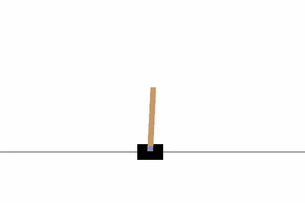
  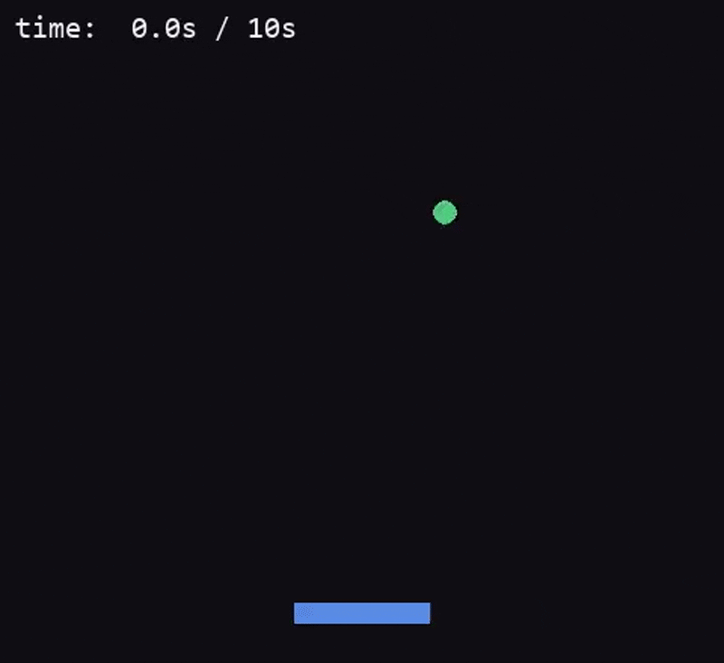
  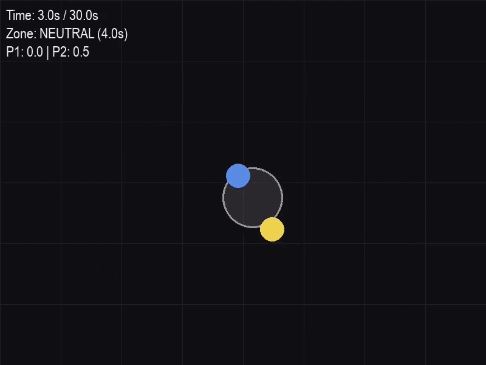
</p>

Me struggling to win against my own agent:
<p float="center">
  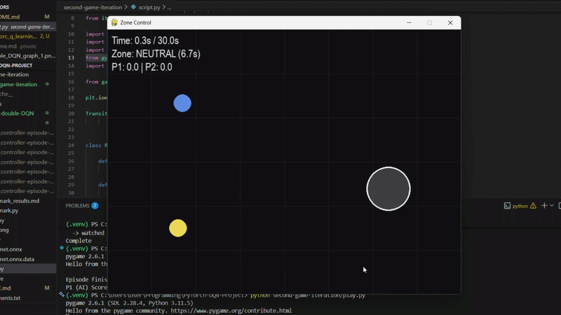
</p>

---

## Table of Contents
- [Overview](#overview)
- [Project Structure](#project-structure)
- [1. Baseline: DQN on CartPole](#1-baseline-dqn-on-cartpole)
- [2. Bounce Platform](#2-bounce-platform)
- [3. Bounce Platform — Double DQN](#3-bounce-platform--double-dqn)
- [4. Zone Capture](#4-zone-capture)
- [5. Inference Benchmarking: PyTorch vs ONNX](#5-inference-benchmarking-pytorch-vs-onnx)
- [Play Yourself](#play-yourself)
- [Key Learnings](#key-learnings)

---

## Overview

This repository demonstrates my learning curve. I started by exploring existing learning scripts with the Gymnasium environment, learning the principles of DQN implementation. Following the chosen example, I built a first simple game to solidify my understanding and fix any gaps. After a successful implementation, I moved on to create a harder second game that would let me play against my own trained AI. To finish, I conducted latency benchmarking for a deeper analysis of how exported models can perform more efficiently.

**Why this project:** I've always wanted to train my own agents and play my custom games against them. It was also my introduction to PyTorch and its core building blocks — tensors and neural networks.

---

## Project Structure

```
.
├── first-game-iteration/       # Custom game #1 (Bounce Platform): vanilla DQN + double DQN
├── second-game-iteration/      # Custom game #2 (ZoneCapture): double DQN + benchmarking
├── cartpole-studying/          # Example DQN script used for studying (CartPole): vanilla DQN
```

---

## 1. Baseline: DQN on CartPole

A standard, pre-built DQN implementation trained on the classic `CartPole-v1` environment, used to learn and validate the core DQN algorithm before building custom environments.

- **Purpose:** learning exercise for the DQN implementation / experiments with code
- **Environment:** OpenAI Gym `CartPole-v1`

<p float="center">
  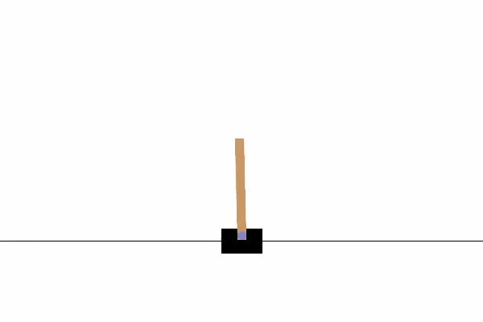
  
</p>

<!-- I will talk about the following 3 points: Deconstructing RL Stability Techniques, Translating Math into PyTorch Architecture,
and Managing the Exploration-Exploitation Trade-off -->

---

## 2. Bounce Platform

A simple game I built using the Gymnasium environment: the agent controls a platform that must move left/right to keep a ball from falling past the bottom of the screen.

<p float="center">
  
  
  
</p>

- **Progress Graph:**
<p float="center">
  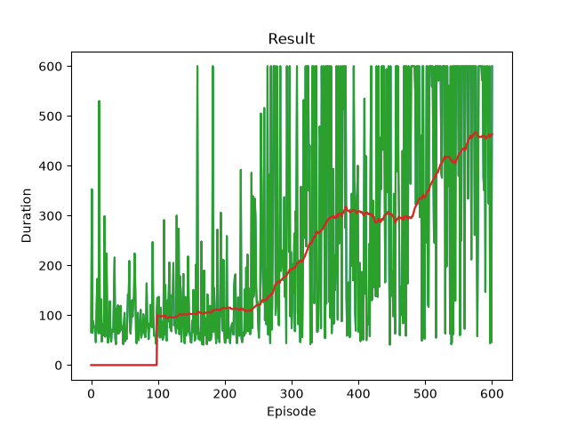
</p>

**Results:**
By the last episode, the agent successfully learned to follow the platform in order to bounce off the falling ball.

<!-- This is where I learned how to design a reward function: I will talk about how it was not learning well till I improved the function -->

---

## 3. Bounce Platform — Double DQN

I decided to explore the concept of Double DQN: it was developed in order to ... . The same Bounce Platform environment was used.

- **Progress Graphs (2 runs):**
<p float="center">
  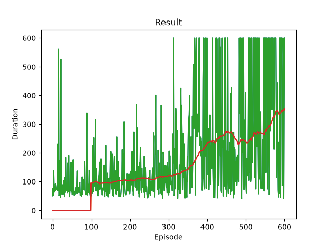
  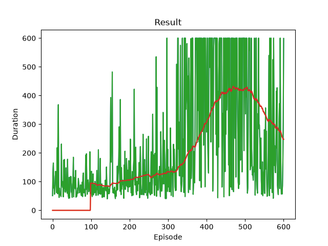
</p>

**Results:**
Counter-intuitively, the Double DQN agent learned **worse** than the vanilla DQN on this environment. This is seen by ...

<!-- I will talk here why this might have happened. I will bring up what I could try in future to resolve this problem -->

---

## 4. Zone Capture

A significantly harder environment where the agent plays **against** the user, having been trained against a scripted bot opponent. This was much more fun to implement and test, as I could physically play against my own trained model.

<p float="center">
  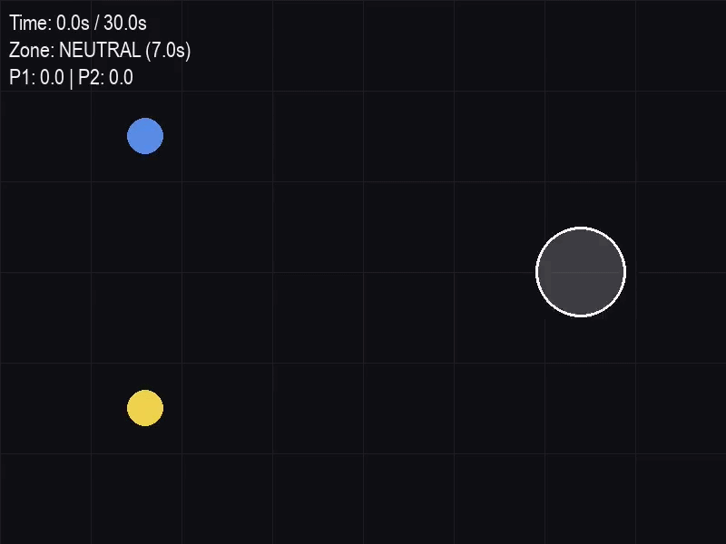
  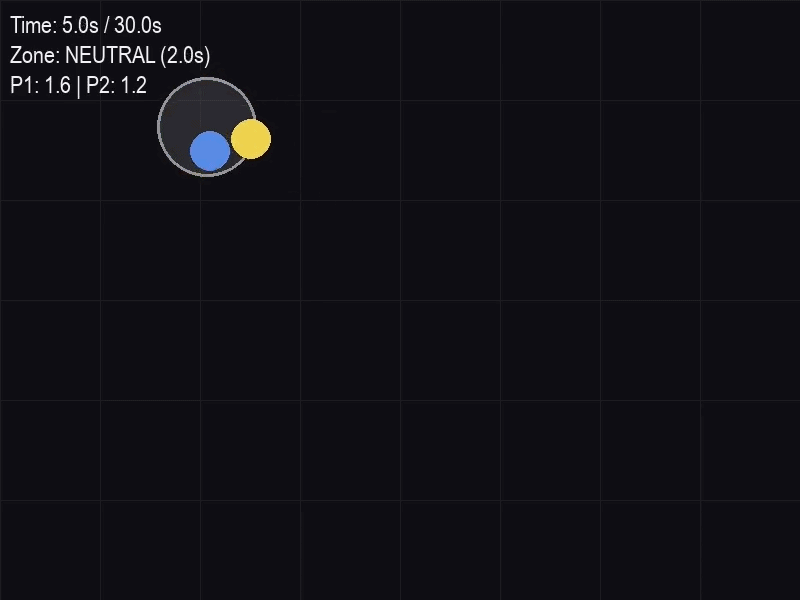
  
</p>

- **Progress Graph:**
<p float="center">
  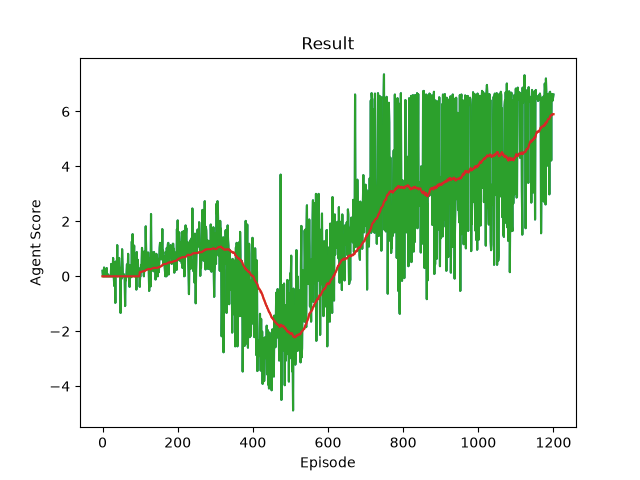
</p>

**What made this harder:**
<!-- I will talk about what made this game much harder to train an agent for -->

**Results:**
<!-- I will talk about how the agent learned to capture the zone, compete against us, and avoid it when hot -->

<!-- I will talk about how this script differs from Bounce Platform (what changes I had to make to the learning approach) -->

---

## 5. Inference Benchmarking: PyTorch vs ONNX

I conducted a short benchmarking exercise (for the Zone Capture game's best policy) comparing raw PyTorch inference latency against an ONNX-exported version of the same trained model.

- **Method:**
<!-- I will describe the method used -->

| Backend | Avg. Latency (over 5 runs) |
|---|---|
| PyTorch (raw) | `0.0454 ms` |
| ONNX Runtime | `0.0165 ms` |

<!-- I will emphasise how much of an improvement there was and how it's useful in the real world -->

---

## Play Yourself

You can play Zone Capture against the AI agent yourself!

1. Install dependencies from [requirements.txt](requirements.txt)
2. Run:
   ```
   python second-game-iteration/play.py
   ```

If you want to test out other policies, change `model_path` in `second-game-iteration/play.py`, inside the `play_against_agent()` function.

---

## Key Learnings

<!-- I will summarize 3-4 top takeaways from this project here, e.g. reward function design, why Double DQN underperformed here, what made Zone Capture harder to train, PyTorch vs ONNX trade-offs -->

---

## Author

Mark Tarnavskyi — [LinkedIn](https://www.linkedin.com/in/marktarnavskyi/)