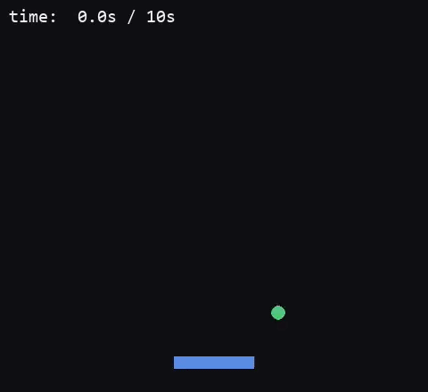
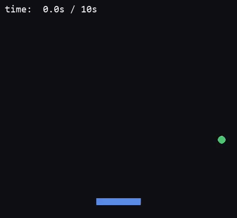

# Reinforcment Learning - Deep Q-Learning from CartPole to Custom Games

> A progression of Deep Q-Network (DQN) implementations, from a standard baseline to two custom-built game environments, with double DQN comparison and PyTorch → ONNX inference benchmarking.

